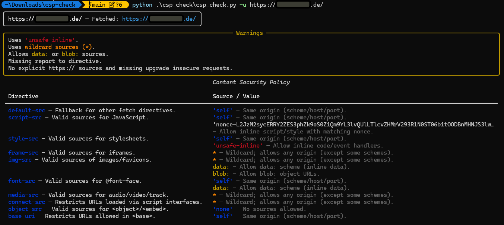

# CSP-Check

**CSP-Check** is a command-line tool for inspecting and analyzing the
[`Content-Security-Policy`](https://developer.mozilla.org/en-US/docs/Web/HTTP/Headers/Content-Security-Policy)
headers of one or multiple web applications.

---

## Installation

Requires **Python 3.12+**

### Using pipx (recommended)

```bash
pipx install .
# or
pipx install git@github.com:arantarion/csp-check.git
```

### Using uv

```bash
uv tool install .
# or
uv tool install https://github.com/arantarion/csp-check.git
# or directly call the script
uv run csp_check/csp_check.py
```

### Using pip (editable/development)

```bash
pip install -e .
```

---

## Usage

```bash
usage: csp_check.py [-h] (-u URL | -f FILE) [-c COOKIES] [-o OUTPUT] [--format {text,raw,json,latex}] [-l LANG] [--proxy PROXY] [--insecure] [-r]

Inspect the Content-Security-Policy header for one or many URLs.

options:
  -h, --help            show this help message and exit
  -u URL, --url URL     Single URL/domain to check.
  -f FILE, --file FILE  Path to a file with one URL per line.
  -c COOKIES, --cookies COOKIES
                        Semicolon-separated cookies: 'a=b; c=d'
  -o OUTPUT, --output OUTPUT
                        Write results to this file. If omitted, prints to console (unless --format=latex).
  --format {text,raw,json,latex}
                        Output format when writing to a file. Default: text.
  -l LANG, --lang LANG  Language for LaTeX output (de|en|german|english). Default: de.
  --proxy PROXY         Comma-separated list of proxy URLs to use, e.g. 'http://127.0.0.1:8080,https://proxy2:443'.
  --insecure            Disable SSL certificate verification.
  -r, --redirect        Allows redirects.

Examples:
  csp_check.py -u https://example.com
  csp_check.py -f urls.txt
  csp_check.py -u example.com -o results.txt
  csp_check.py -u example.com -o results.json --format json
  csp_check.py -u example.com -o results.tex --format latex --lang de
```

---

## Example Output


