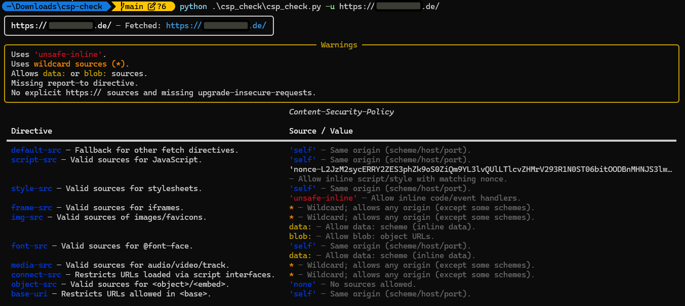

# CSP-Check

**CSP-Check** is a command-line tool for inspecting and analyzing the
[`Content-Security-Policy`](https://developer.mozilla.org/en-US/docs/Web/HTTP/Headers/Content-Security-Policy)
headers of one or multiple web applications.

---

## Installation

Requires **Python 3.12+**

### Using pipx (recommended)

```bash
pipx install .
# or
pipx install git@github.com:arantarion/csp-check.git
```

### Using uv

```bash
uv tool install .
# or
uv tool install https://github.com/arantarion/csp-check.git
# or directly call the script
uv run csp_check/csp_check.py
```

### Using pip (editable/development)

```bash
pip install -e .
```

---

## Usage

```
Usage: csp-check [OPTIONS]

  Inspect the Content-Security-Policy header for one or many URLs.

  Examples:
    csp-check -u https://example.com
    csp-check -f urls.txt
    csp-check -u example.com -o results.txt
    csp-check -u example.com -o results.json --format json
    csp-check -u example.com -o results.tex --format latex --lang de

Options:
  -u, --url TEXT                  Single URL/domain to check.
  -f, --file TEXT                 Path to a file with one URL per line.
  --csp                           Open an interactive input to paste a CSP
                                  and parse it.
  -c, --cookies TEXT              Semicolon-separated cookies: 'a=b; c=d'
  -H, --headers TEXT              Semicolon-separated headers: 'X-Token: abc;
                                  Accept: text/html'
  -o, --output TEXT               Write results to this file. If omitted,
                                  prints to console (unless --format=latex).
  --format [text|raw|json|latex]  Output format.  [default: text]
  -l, --lang TEXT                 Language for LaTeX output
                                  (de|en|german|english).  [default: de]
  --proxy TEXT                    Comma-separated list of proxy URLs, e.g.
                                  'http://127.0.0.1:8080,https://proxy2:443'.
  --insecure                      Disable SSL certificate verification.
  -r, --redirect                  Allows redirects.
  -t, --threads INTEGER           Max concurrent requests when fetching
                                  multiple URLs.  [default: 20]
  --retries INTEGER               Number of retry attempts for transient
                                  network errors.  [default: 2]
  --timeout FLOAT                 Per-request timeout in seconds.
                                  [default: 15.0]
  --check-orphans                 Resolve allowlisted domains via DNS/WHOIS and
                                  flag orphaned (unregistered, attacker-
                                  claimable) ones.
  --dns-resolvers TEXT            Comma-separated DNS resolvers used for
                                  --check-orphans.  [default: 8.8.8.8,1.1.1.1]
  --dns-timeout FLOAT             Per-domain DNS resolve timeout in seconds for
                                  --check-orphans.  [default: 3.0]
  -h, --help                      Show this message and exit.
```

---

## Orphaned (dangling) domains

A host allowlisted in a CSP whose registrable domain no longer resolves — or was
never registered — is a real risk: an attacker can register it and serve scripts,
styles or frames from a source the policy already trusts, sidestepping the CSP.
These entries are frequently typos (e.g. `gogle-analytics.com`).

Pass `--check-orphans` to perform live DNS (and, if `python-whois` is installed,
WHOIS) lookups on every registrable domain referenced across all checked CSPs.
Each registrable domain is resolved once and de-duplicated across URLs.
Orphaned sources are highlighted in the text output (`[ORPHAN: <status>]`),
included in the JSON output (`orphan_findings` and per-item `is_orphan`), and —
for LaTeX output — summarized together with the known bypass domains in a
`%`-prefixed comment block appended under the generated finding.

> **Note:** `--check-orphans` makes outbound DNS/WHOIS requests and is therefore
> opt-in. It does nothing in `--csp` mode unless the flag is given.

---

## Shell Autocompletion

`csp-check` supports shell autocompletion via [Click's completion mechanism](https://click.palletsprojects.com/en/stable/shell-completion/).
The environment variable name is derived from the command name: `_CSP_CHECK_COMPLETE`.

### Bash

Add to `~/.bashrc`:

```bash
eval "$(_CSP_CHECK_COMPLETE=bash_source csp-check)"
```

### Zsh

Add to `~/.zshrc`:

```zsh
eval "$(_CSP_CHECK_COMPLETE=zsh_source csp-check)"
```

### Fish

Add to `~/.config/fish/completions/csp-check.fish`:

```fish
_CSP_CHECK_COMPLETE=fish_source csp-check | source
```

> **Note:** Fish completion requires `click < 8.4`. Click 8.4.x ships a broken
> fish completion template (a literal newline in `string split` produces errors
> like `string split: missing argument` and `Unknown command: plain`). This is
> why `csp-check` pins `click<8.4` in `pyproject.toml`. If you installed an older
> build that pulled in click 8.4.x, reinstall to pick up a working version, e.g.
> `pipx install --force .` or `uv tool install --force .`.

After adding the line, restart your shell or source the config file for the changes to take effect.

---

## Example Output


